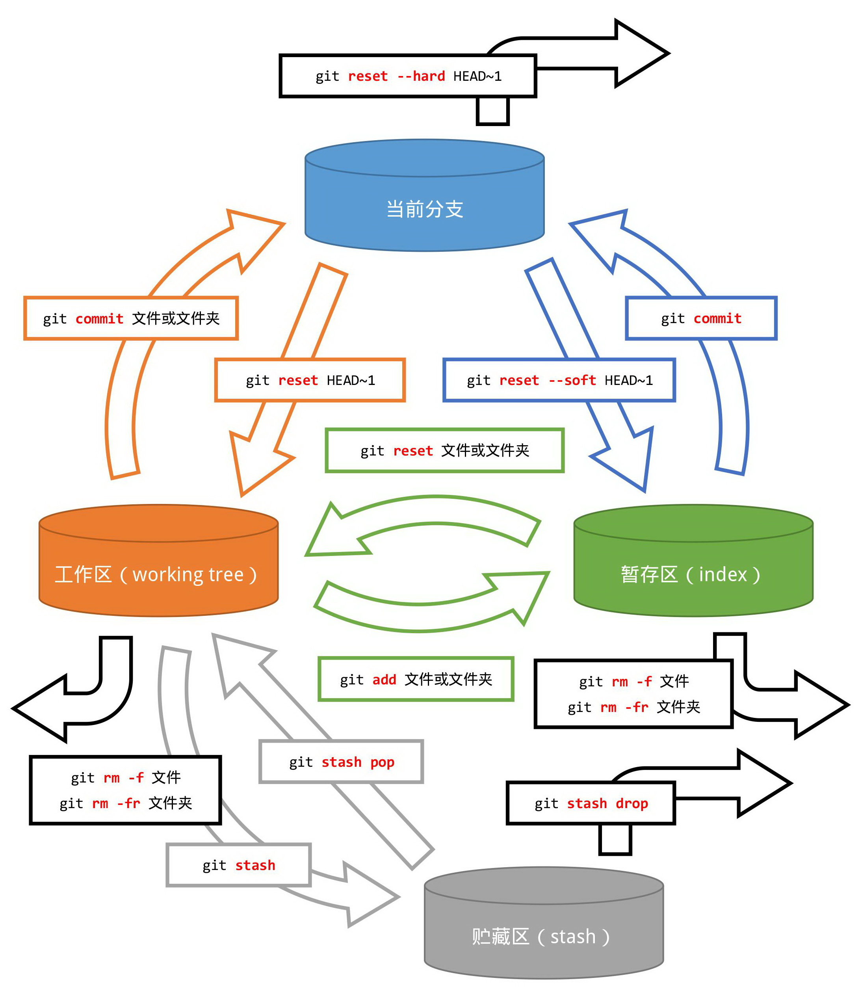

# Git 入门命令参考

## 前言

为了降低入门难度，这部分参考的内容是按照 **常用操作** 而不是按照命令排序的。由于 Git 命令被 **极其糟糕** 地重载， _去读他喵的手册（RTFM）_ 虽然是正统且全面的指南，但是被认为不能帮助新手很快地投入日常使用。

## 格式说明

本文中所有的 _术语（term）_ 皆以 _斜体字_ 标出。_术语_ 的含义是 **明确的**、 **严格的**、 **不可替代的**。在 _术语_ 首次出现时，它会被标明对应的英文原文。

* 尖括号 `<>` 表示必需参数，方括号 `[]` 表示可选参数。
* `[--]` 用于分隔文件路径和参数。不过，一般情况下不需要这个分隔符，除非文件名以 `-` 开头使得它看来像一个参数。当此分隔符为必需时，将额外说明。
* `...` 表明前面邻接的参数可以有多个。
* 未以此法标出的部分（包括空格）应当被 **原样复制**。

## 命令参考



#### 将 _仓库（repository）_ _克隆（clone）_ 到本地文件系统。

克隆到和仓库同名的文件夹：  
```text
git clone <仓库地址>
```

克隆到指定的文件夹：  
```text
git clone <仓库地址> [--] <目标文件夹>
```

#### 添加 _工作区（working tree）_ 已修改的文件到 _暂存区（index）_ 等待提交（开始跟踪）

添加文件或一个文件夹下的所有未被忽略的文件：  
```text
git add [--] <待添加的文件或文件夹>...
```

强制添加已被忽略的文件或文件夹：  
```text
git add -f [--] <待添加的文件或文件夹>...
```

#### 撤销 `git add` 操作

撤销文件或文件夹下的所有文件（方法一）：  
```text
git reset [--] <待撤销的文件或文件夹>...
```

撤销文件或文件夹下的所有文件（方法二）：  
```text
git rm --cached [--] <待撤销的文件>...
git rm --cached -r [--] <待撤销的文件夹>...
```

#### 提交 _暂存区_ 的修改

创建新的 _提交（commit）_，打开文本编辑器书写提交日志：  
```text
git commit
```

创建新的 _提交_，直接在命令行上写入提交日志：  
```text
git commit -m <提交日志>
```

修改最后一次 _提交_，打开文本编辑器书写提交日志：  
```text
git commit --amend
```

修改最后一次 _提交_，直接在命令行上写入提交日志：  
```text
git commit --amend -m <提交日志>
```

#### 绕过 _暂存区_ 提交指定的文件

打开文本编辑器书写提交日志（如果待提交的文件或文件夹已经从文件系统删除，就必须使用 `--` 来标示路径）：  
```text
git commit [--] <待提交的文件或文件夹>...
```

直接在命令行上写入提交日志（如果待提交的文件或文件夹已经从文件系统删除，就必须使用 `--` 来标示路径）：  
```text
git commit -m <提交日志> [--] <待提交的文件或文件夹>...
```

修改最后一次 _提交_，打开文本编辑器书写提交日志（如果待提交的文件或文件夹已经从文件系统删除，就必须使用 `--` 来标示路径）：  
```text
git commit --amend [--] <待提交的文件或文件夹>...
```

修改最后一次 _提交_，直接在命令行上写入提交日志（如果待提交的文件或文件夹已经从文件系统删除，就必须使用 `--` 来标示路径）：  
```text
git commit --amend -m <提交日志> [--] <待提交的文件或文件夹>...
```

#### 移除已经提交的文件或文件夹（停止跟踪）

移除文件或文件夹并删除它，如果有未提交的修改则该操作失败：  
```text
git rm [--] <待移除的文件>...
git rm -r [--] <待移除的文件夹>...
```

移除文件或文件夹并删除它，如果有未提交的修改则丢弃之：  
```text
git rm -f [--] <待移除的文件>...
git rm -fr [--] <待移除的文件夹>...
```

#### 撤销最后一次的 `git commit` 操作

撤销提交，被提交的修改进入 _工作区_：  
```text
git reset HEAD~1
```

撤销提交，被提交的修改进入 _暂存区_：  
```text
git reset --soft HEAD~1
```

撤销提交，丢弃已提交的修改：  
```text
git reset --hard HEAD~1
```

#### 还原对文件或文件夹的修改

将文件或文件夹的修改还原至 _暂存区_ 的状态：  
```text
git checkout [--] <待还原的文件或文件夹>...
```

将文件或文件夹的修改还原至最后一次提交的状态：  
```text
git checkout HEAD [--] <待还原的文件或文件夹>...
```

将文件或文件夹的修改还原至上一次提交的状态：  
```text
git checkout HEAD~1 [--] <待还原的文件或文件夹>...
```

将文件或文件夹的修改还原至其他分支的状态：  
```text
git checkout <源分支> [--] <待还原的文件或文件夹>...
```

#### 丢弃所有修改

丢弃 _工作区_ 的所有修改：  
```text
git checkout -- :/
```

丢弃 _暂存区_ 和 _工作区_ 的所有修改（方法一）：  
```text
git checkout HEAD -- :/
```

丢弃 _暂存区_ 和 _工作区_ 的所有修改（方法二）：  
```text
git checkout -f
```

丢弃 _暂存区_ 和 _工作区_ 的所有修改（方法三）：  
```text
git reset --hard
```

#### 解决 _冲突（conflict）_

使用 _工作区_ 的文件来解决冲突：  
```text
git add <冲突的文件>...
```

删除指定的文件来解决冲突：  
```text
git rm --force <冲突的文件>...
```

#### 从其他分支提取文件或文件夹

从其他分支提取文件或文件夹进入 _暂存区_（如果文件参数是当前文件系统中不存在的文件，就必须使用 `--` 来标示路径）：  
```text
git checkout <源分支> [--] <待提取的文件或文件夹>
```

提取发生 _冲突_ 的文件的对应当前分支（对于 `git merge`）或目标分支（对于 `git rebase`）上的文件或文件夹进入 _工作区_，保留冲突状态：  
```text
git checkout --ours [--] <待提取的文件或文件夹>
```

提取发生 _冲突_ 的文件的对应目标分支（对于 `git merge`）或当前分支（对于 `git rebase`）上的文件或文件夹进入 _工作区_，保留冲突状态：  
```text
git checkout --theirs [--] <待提取的文件或文件夹>
```

#### 清理不需要的文件

删除 _工作区_ 中当前目录下的所有未被跟踪的文件和文件夹，包括已忽略的：  
```text
git clean -fdx
```

删除 _工作区_ 中当前目录下的所有未被跟踪的文件和文件夹，除了已忽略的：  
```text
git clean -fd
```

删除 _工作区_ 中当前目录下的所有已忽略的文件和文件夹：  
```text
git clean -fdX
```

#### 查看文件状态

查看 _暂存区_ 和 _工作区_ 的所有文件状态：  
```text
git status -s
```

```text
M     已向暂存区添加
D     已从暂存区删除
 M    已在工作区修改
 D    已从工作区删除
UU    冲突
??    未跟踪
```

#### 查看分支

查看 _本地分支（local branch）_：  
```text
git branch
```

查看 _本地分支（local branch）_ 和 _远端分支（remote branch）_：  
```text
git branch -a
```

```text
master                  本地分支 master
remotes/origin/master   远端分支 origin/master （对应 origin 远端上的 master 分支）
remotes/upstream/temp   远端分支 upstream/temp （对应 upstream 远端上的 temp 分支）
```

#### 切换分支

切换到指定的分支：  
```text
git checkout <目标分支>
```

切换到上一次切换以前的分支：  
```text
git checkout -
```

#### 创建分支

创建一个和当前分支一样的分支并保持当前分支不变，如果新分支已存在则该操作失败：  
```text
git branch <新分支>
```

创建一个和当前分支一样的分支并切换到新分支，如果新分支已存在则该操作失败：  
```text
git checkout -b <新分支>
```

创建一个和当前分支一样的分支并切换到新分支，如果新分支已存在则覆盖之：  
```text
git checkout -B <新分支>
```

#### 删除分支

删除 _本地分支_，如果分支未被 _合并（merge）_ 到 _上游分支（upstream branch）_ 则该操作失败：  
```text
git branch -d <旧分支>
```

删除 _本地分支_，不检查合并状态：  
```text
git branch -D <旧分支>
```

#### 重命名分支

重命名 _本地分支_：  
```text
git branch -m <旧分支> <新分支>
```

#### 从 _远端_ 更新分支到本地的 _远端分支_

更新当前分支的 _上游分支_ 的 _远端_ 上的所有分支到本地的 _远端分支_：  
```text
git fetch
```

更新指定 _远端_ 上的所有分支到本地的 _远端分支_：  
```text
git fetch <远端>
```

更新所有 _远端_ 上的所有分支到本地的 _远端分支_：  
```text
git fetch --all <远端>
```

#### 从其他分支更新数据到本地的 _本地分支_

将其它分支 _合并（merge）_ 到当前分支（创建合并节点，当前分支变为该节点的子分支）：  
```text
git merge <目标分支>...
```

将另一条分支 _合并_ 到当前分支，如果目标分支不是当前分支的子分支则该操作失败：  
```text
git merge --ff-only <目标分支>
```

将当前分支 _变基（rebase）_ 到另一条分支（将两条分支不同部分切除，然后拼接在目标分支之后，结果保存为当前分支）：  
```text
git rebase <目标分支>
```

复制另一条分支到当前分支：
```text
git reset --hard <目标分支>
```

#### 从 _远端_ 更新数据到本地的 _远端分支_ 和 _本地分支_

更新当前分支的 _上游分支_ 的 _远端_ 上的所有分支到本地的 _远端分支_，再使用 `git merge` 更新 _本地分支_：  
```text
git pull
```

更新当前分支的 _上游分支_ 的 _远端_ 上的所有分支到本地的 _远端分支_，再使用 `git merge --ff-only` 更新 _本地分支_：  
```text
git pull --ff-only
```

更新当前分支的 _上游分支_ 的 _远端_ 上的所有分支到本地的 _远端分支_，再使用 `git rebase` 更新 _本地分支_：  
```text
git pull --rebase
```

#### 更新 _远端_ 上的分支

更新当前分支到其 _上游分支_：  
```text
git push
```

更新指定的 _本地分支_ 到指定 _远端_ 上的 _上游分支_，如果 _本地分支_ 没有 _上游分支_ 则该操作失败：  
```text
git push <远端> <本地分支>
```

更新指定的 _本地分支_ 到指定 _远端_ 上的 _上游分支_，如果 _本地分支_ 没有 _上游分支_ 则使用同名的分支作为 _上游分支_ 并设置之：  
```text
git push -u <远端> <本地分支>
```

更新当前分支到指定 _远端_ 上的指定分支：  
```text
git push -u <远端> HEAD:<分支>
```

更新指定的 _本地分支_ 到指定 _远端_ 上的指定分支：  
```text
git push -u <远端> <本地分支>:<分支>
```

删除指定 _远端_ 上的指定分支：  
```text
git push -u <远端> :<分支>
```
