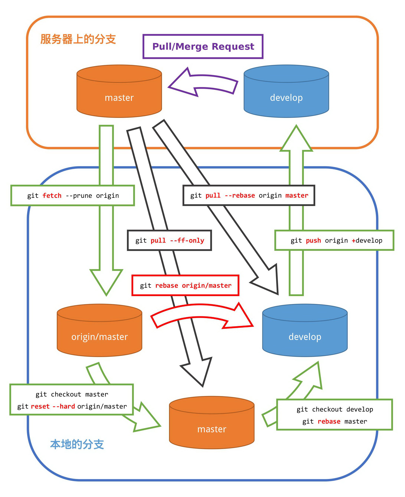

# Git 工作指南

## 前言

作为一个非常有历(wei)史(dao)的 _版本控制系统_ ，Git 理所当然地存在很多历史遗留问题。然而我们不想解决历史遗留问题——它们实在是太多了。
所以，你应该学会叫 Git 这个 git（饭桶）闭嘴；至少，不要叫那些历史遗留的 s@#t 来污染你的大脑。

如果你不能理解本文的内容，照着做就是了；如果你连照着做也做不到，就不要用 Git。

## 获得一个文本编辑器

Git 有时候需要你使用 [文本编辑器](https://en.wikipedia.org/wiki/Text_editor) ，例如你使用 `git commit` 的时候它会提示你输入提交注释，你使用 `git rebase -i` 的时候它会将即将执行的命令的清单显示给你并且你可能会对其进行修改。那个叫 [vim](https://vim.sourceforge.io/) 的 [_不配_ 被称为文本编辑器](https://stackoverflow.blog/2017/05/23/stack-overflow-helping-one-million-developers-exit-vim/)。我们推荐使用 [GNU nano](https://www.nano-editor.org/)。如果你在用 Windows，可以试试 [这个](https://files.lhmouse.com/nano-win/)。

## 修改全局设置

在你能好好地使用 Git 管理你的代码之前，把这几个设置改一下：  
```sh
$ git config --global color.status auto       # 使 git status -s 命令的输出带有颜色。
$ git config --global color.diff auto         # 使 git diff -s 命令的输出带有颜色。
$ git config --global color.branch auto       # 使 git branch -a 命令的输出带有颜色。
$ git config --global color.interactive true  # 使 git add -i 命令的输出带有颜色。
$ git config --global core.editor /bin/nano   # 请不要理会那个竟然敢自称编辑器的叫 vi 的智障。
$ git config --global core.pager "less -x1,5" # 设置好 diff 的对齐。 [1]
$ git config --global core.autocrlf input     # 别把 CR LF 提交到服务器上。
$ git config --global push.default simple     # 仅 push 当前分支。
$ git config --global pull.ff only            # 禁用非 --ff-only 的 pull 操作。
$ git config --global merge.ff only           # 禁用非 --ff-only 的 merge 操作。
```

[1] <http://lists.gnu.org/archive/html/nano-devel/2017-12/msg00117.html>

## 开发者手册

1. 《Git 工作流程》  
<http://www.ruanyifeng.com/blog/2015/12/git-workflow.html>  
仅参考其中的 Gitlab flow。
master 分支（debug/unstable）仅作开发，产品分支（release/stable）仅以 cherry-pick 更新。

2. 《常用 Git 命令清单》  
<http://www.ruanyifeng.com/blog/2015/12/git-cheat-sheet.html>

3. 《Git 使用规范流程》  
<http://www.ruanyifeng.com/blog/2015/08/git-use-process.html>

## 禁止事项

1. 禁止直接在 master 分支上开发。
2. 禁止直接向 master 和 release/stable 分支 push。
3. 禁止 merge， `--ff-only` 除外。
4. 禁止 pull， `--ff-only` 和 `--rebase` 除外。
5. 文本文件禁止使用宽字符编码，非手动编辑的文件除外。



## 一般开发流程

1. _获取_ 最新代码：  
    ```sh
    $ git checkout master
    $ git fetch
    $ git reset --hard origin/master
    ```
2. _创建_ 用于开发的 _本地分支_ （此处假定用于开发的分支名为 working）：  
    ```sh
    $ git checkout -b working
    ```
3. 在 working 分支上 _进行修改_ 。  
4. _提交修改_ 到 working 分支：  
    ```sh
    $ git add 第一个文件
    $ git add 第二个文件
    $ git commit
    ```
5. 将本地分支 working _推送_ 到服务器上，创建一个新的 _远端分支_ origin/working：  
    ```
    $ git push origin working
    ```
6. 在 GitLab 上查看推送的分支， _创建_ 到 master 分支的 _Merge Request_ 。  
7. 查看新建的 Merge Request，如果没有冲突，点击 _合并_ 。  
8. 再次 _获取_ 最新的代码：  
    ```sh
    $ git checkout master
    $ git pull --ff-only
    ```
9. _删除本地的_ 开发 _分支_ ：  
    ```sh
    $ git branch -d working
    ```
10. _删除服务器上的_ 开发 _分支_ ：  
    ```sh
    $ git push origin :working
    ```
## 如何解决冲突：

1. _获取_ 最新代码：  
    ```sh
    $ git fetch
    ```
2. 如果本地有没提交的修改， _提交_ 之，否则无法进行变基操作。  
3. 执行 _变基_ 操作，基于新的远端分支 origin/master：  
    ```sh
    $ git rebase origin/master
    ```
4. 如果提示 CONFLICT， _查看_ 当前变基 _状态_ ：  
    ```sh
    $ git status -s
    ```
    ```text
    M  暂存区　　变基并且没有冲突的文件
     M 工作区　　修改但是没有提交的文件
    ?? 非追踪　　没有加入版本控制的文件
    UU 冲突　　　变基出现冲突的文件
    ```
5. 解决冲突：  
    1. 查找 `<<<<<<<` （7 个）标记并进行编辑，保存为要保留的内容，然后标记为 _已解决_ ：  
        ```sh
        $ git add 变基出现冲突的文件
        ```
        2. _丢弃本地的修改_ ，使用服务器的文件（对于变基操作 `--ours` 是 _基点_ ）：  
        ```sh
        $ git checkout --ours 变基出现冲突的文件
        $ git add 变基出现冲突的文件
        ```
        3. _丢弃服务器的修改_ ，使用本地的文件（对于变基操作 `--theirs` 是 _本地_ ）：  
        ```sh
        $ git checkout --theirs 变基出现冲突的文件
        $ git add 变基出现冲突的文件
        ```
6. 重复 3~5 直到解决所有冲突，然后 _继续变基操作_ ：  
    ```sh
    $ git rebase --continue
    ```
7. 重复 3~6 直到变基完成。  
8. 用本地的 working 分支 _覆盖服务器上的_ working _分支_ ：  
    ```sh
    $ git push origin +working
    ```
9. _重新尝试合并_ 出现冲突的 Merge Request。  

## 如果变基到一半不想变基了怎么办

1. _取消变基操作_ ，本地已提交的修改不会丢失：  
    ```sh
    $ git rebase --abort
    ```

## 切记

1. 切换分支之前把本地需要提交的修改全部提交。  
2. 如果涉及到合并或重置代码，创建新的分支做。原有分支不会受到影响。  
3. 没事不要 merge。  
4. 没事不要 merge。  
5. 没事不要 merge。  

## 对于已 fork 的仓库怎么合并上游修改、发布补丁

（以下假定下游远端为 origin，上游远端为 upstream，双方的主分支都是 master。）

1. 获取上游仓库：  
    ```sh
    $ git fetch upstream
    ```
2. 以当前分支为原本，创建一个新的分支用于变基：  
    ```sh
    $ git checkout -b rebasing
    ```
3. 对本地修改进行变基：  
    ```sh
    $ git rebase upstream/master
    ```
4. 如果遇到冲突，解决冲突。  
5. 变基结束后，测试新的分支。  
6. 如果测试没有问题，用新的分支 _替换_ 原来的分支：  
    ```sh
    $ git checkout -B master
    ```
8. 用本地的 master 分支 _覆盖服务器上的_ master _分支_ ：  
    ```sh
    $ git push origin +master
    ```
9. 将本地相对于上游新增的补丁导出成 .patch 文件（可以使用电子邮件发送给上游）：  
    ```sh
    $ git format-patch upstream/master
    ```

## 合并下游补丁

1. 应用补丁文件：  
    ```sh
    $ git am 第一个补丁文件 第二个补丁文件
    ```

2. 推送到远端分支  
    ```sh
    $ git push
    ```

## 从其他分支挑拣单个提交

1. 挑拣单个提交：  
    ```sh
    $ git cherry-pick 单个提交散列标识
    ```

2. 推送到远端分支  
    ```sh
    $ git push
    ```
